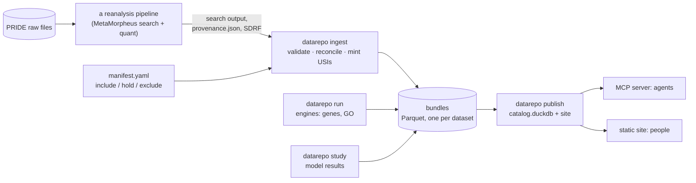

# dataRepo

**Software that turns reanalysed public proteomics data into one repository that AI agents can
query and people can browse.**

[](https://github.com/smith-chem-wisc/dataRepo/actions/workflows/ci.yml)
[](LICENSE)

A project that reanalyses many PRIDE datasets ends up with a folder of search and quantification
output per dataset, each a little different and none comparable as it stands. dataRepo reads those
folders and loads every dataset into **one schema**. The tables are versioned, and each is checked
against the search engine's own totals. It then builds **one catalog** from them and serves it:

- **to agents**, over MCP. Every answer names the exact catalog it came from, and an empty table
  never passes for a negative answer;
- **to people**, as a static website with one page per dataset, which needs no server;
- **to programs**, as Parquet, JSON, `llms.txt` and Croissant.

It is built for questions that span datasets, such as *"which mitochondrial proteins decline with age
in skeletal muscle, in how many datasets, and show me the spectra"*. Agents are the main users.

> **Status: released**, datarepo **1.3.0**, core schema **0.0.15**. One self-contained program
> for Windows, Linux and macOS: no .NET, Python or other install needed. `ingest`, `study`, `run`,
> `build`, `publish`, `site`, `query` and the MCP server are working. They run against the
> [aging project](https://github.com/trishorts/aging)'s corpus of about 60 reanalysed datasets,
> served at [trishorts.github.io/aging-pipeline](https://trishorts.github.io/aging-pipeline/).
> The schema is not locked yet. Bundles and catalogs are content-addressed, so a change gives new ids
> and never silently alters data someone has cited.

## Try it in ten minutes

```bash
# the program: one archive per platform (win-x64 .zip; linux-x64, osx-arm64, osx-x64 .tar.gz)
curl -LO https://github.com/smith-chem-wisc/dataRepo/releases/download/v1.3.0/datarepo-1.3.0-linux-x64.tar.gz
tar -xzf datarepo-1.3.0-linux-x64.tar.gz && export PATH="$PWD/datarepo:$PATH"
# the example instance, from this repository
git clone --depth 1 --branch v1.3.0 https://github.com/smith-chem-wisc/dataRepo.git dataRepo-src
cp -r dataRepo-src/tests/data example-instance && cd example-instance

datarepo ingest  manifest.yaml PXD999999                  # one dataset's search output -> a bundle
datarepo publish manifest.yaml --site site                # every bundle -> a catalog and a website
datarepo query   catalog.duckdb "SELECT * FROM dataset_overview"
datarepo mcp --catalog catalog.duckdb --install           # hand it to an agent (Claude Code)
```

[**docs/getting-started.md**](docs/getting-started.md) walks through the same steps on every
platform, with the real output, and explains what each one did. To build the program from source
instead, see [operating.md](docs/operating.md#building-from-source).

## How it fits together



| Step | What it guarantees |
|---|---|
| **ingest** | Nothing is re-run or recomputed. Every count is reconciled against the search engine's own totals, and every PSM links to its spectrum by [USI](https://www.psidev.info/usi). Problems are recorded as *findings* that travel with the data. |
| **bundle** | Immutable, and named by a hash of its inputs, the schema version and the ingester version. The same inputs give the same id; one changed byte gives a new bundle beside the old one. |
| **publish** | Builds a catalog from every dataset the manifest includes, and runs its integrity checks (57 on the tutorial's catalog). Any failure refuses the build. The same catalog gives a byte-identical site. |
| **MCP** | Three tools (`describe`, `search`, `sql`). Every answer carries its `catalog_id`, and the answer's envelope says when a query read an empty table, a run-relative score or a sample with curated metadata beside it. |

## What makes it trustworthy

- **Missing is missing.** An unmeasured value is no row or NULL, never 0. An empty table and an
  unknown fact are different answers, and they look different.
- **Every number names its definition.** `definition_id` points at the project that defined the
  number, so two conflicting numbers can sit side by side, each labelled.
- **The producer decides what is fit to serve.** A dataset marked `exclude` in the manifest is
  refused with the producer's own reason. dataRepo never overrides it.
- **Caveats come before counts.** A dataset's open findings (a low identification rate, an SDRF
  with no biology in it) appear before its numbers, on its page and in every agent answer.
- **Curated is never confused with deposited.** What an SDRF said and what a curator read from a
  paper live in different tables.
- **Provenance comes from the server, not the query.** Nothing an agent writes can stamp a
  fabricated number with a real catalog id.

[docs/limitations.md](docs/limitations.md) lists every place where a confident answer from this
data would be wrong. Read it before trusting one.

## Documentation

| | |
|---|---|
| [**Getting started**](docs/getting-started.md) | The ten-minute tutorial |
| [**Operating an instance**](docs/operating.md) | Serving your own searches: install, manifest, ingest, publish, host |
| [**Command reference**](docs/cli.md) | Every command and flag, generated from the program |
| [**Query cookbook**](docs/querying.md) | Real questions, the SQL that answers them, and queries that look right and are wrong |
| [**Limitations**](docs/limitations.md) | What this data cannot tell you, with the measurement behind each |
| [**MCP server**](docs/mcp.md) | The agent tools and the guarantees each answer carries |
| [**Schema reference**](docs/schema/core.md) | Every table and column, generated from [`schema/datarepo.yaml`](schema/datarepo.yaml) |
| [**All documentation**](docs/README.md) | The index, a glossary, and the five rules behind the design |

## The schema at a glance

31 core tables, generic to any bottom-up reanalysis and a superset of
[QPX](https://github.com/bigbio/qpx):

| Group | Tables |
|---|---|
| Catalog | `Dataset` · `Release` · `ReleaseChange` · `DatasetCandidate` |
| Design | `Sample` · `SampleCharacteristic` (every SDRF cell, verbatim, with its source) · `Run` · `Assay` |
| Identifications | `Psm` (each with a USI) · `Peptidoform` (ProForma 2) · `ProteinGroup` · `Protein` |
| PTMs, glyco, proteoforms | `PtmSite` · `PtmStoichiometry` · `Glycopeptide` · `ProteoformInference` |
| Quantities | `QuantValue`: long format, one row per (assay, feature), with the zero rule stated per definition |
| From their owners | gene resolutions (logs) · protein annotations and organelle categories (go, aging) · PTM trait effects and pairs (ptmQtl) · localizations · feature sets |
| Trust | `Definition` · `Metric` · `ProvenanceRecord` · `Finding` · `SearchModification` |

**Study layers** add a study's own tables beside the core, keyed on core ids and never altering a
core table. The `aging` layer adds sample ages, age effects and their refusals, a cross-dataset
meta-analysis, and curated sample characteristics. A second study adds its own layer, and the core
never changes for it.

## This repository is software, not data

| | Lives in | Owned by |
|---|---|---|
| Schema, ingester, catalog builder, MCP server, site generator, docs | **this repository** | dataRepo |
| Bundles, catalogs, the site, releases and DOIs | the operator's **instance** | e.g. [aging](https://github.com/trishorts/aging) |
| Raw spectra | PRIDE / ProteomeXchange | the original submitters |

dataRepo **stores and serves**. It never runs a search and never computes science. Every number has
an owner:

| Content | Owner |
|---|---|
| Searches, age statistics, the organelle category map, the benchmark questions | the producing project (today `aging`) |
| GO parsing and propagation | `go` |
| Gene resolution and orthology | `logs` |
| Quantification metric definitions (`DEF-*`) | QuantProject |
| SDRF tooling and age normalization | `sdrf` / mzLib |
| PSM scoring, PEP, PTM stoichiometry | MetaMorpheus / mzLib, and `pep` for PEP's definition |
| Parsing MetaMorpheus output | mzLib (read in-process; pyMzLib for Python callers) |

Who does what between these projects is written down in [design/CHARTER.md](design/CHARTER.md).

## Roadmap

| | Status |
|---|---|
| Ingest, study bundles, engine runner, catalog, MCP server, static site, `publish` | **working** |
| A download that needs nothing installed (PXReprise PXR-D1) | **done in 1.0.0**: dataRepo is now a C# program, released as self-contained executables for Windows, Linux and macOS (arm64, x64), each run end to end in CI before it is attached ([operating.md](docs/operating.md#1-install-one-released-version)). The Python package is frozen at 0.32.0 |
| Question-neutral code throughout (PXR-D2) | in progress: provenance, site and MCP done in 0.30.0 |
| Versioned public releases alongside [PXReprise](https://github.com/smith-chem-wisc/PXReprise) (PXR-D3) | the program: [GitHub releases](https://github.com/smith-chem-wisc/dataRepo/releases) of this repository, from 1.0.0. Where data releases live is to be decided |
| REST API | deferred until a human user asks for REST (D16) |
| A DOI per data release | the operator's step |

## Contributing, licence, citation

- [CONTRIBUTING.md](CONTRIBUTING.md): change the schema YAML, regenerate, and let CI check the rest.
- **Code and schema:** [MIT](LICENSE). **Data served by an instance:** licensed by its operator (the
  aging instance uses CC BY 4.0).
- **Citing:** [CITATION.cff](CITATION.cff). A DOI comes with the first release.
- IDs such as `D27`, `G76` or `DATAREPO-61` in the docs refer to decisions, gaps and cross-project
  questions; [docs/README.md](docs/README.md#conventions-in-these-files) explains each prefix.
